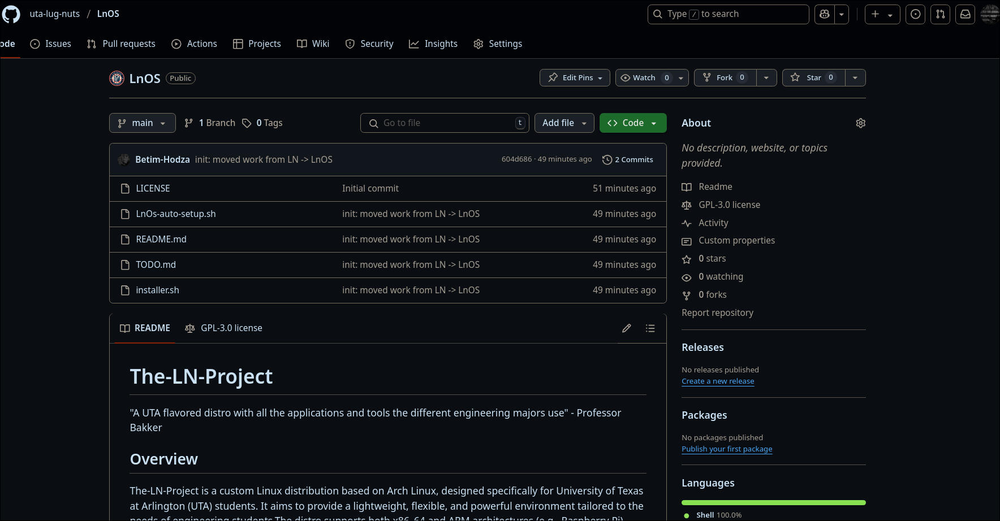
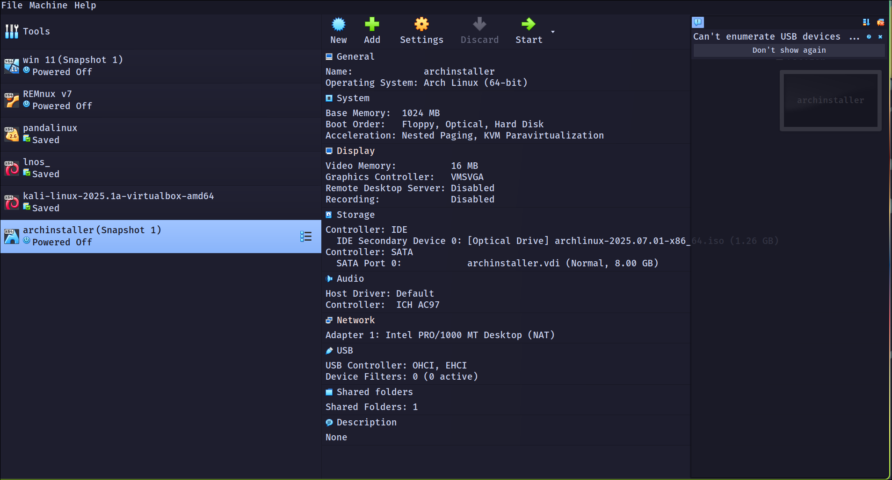
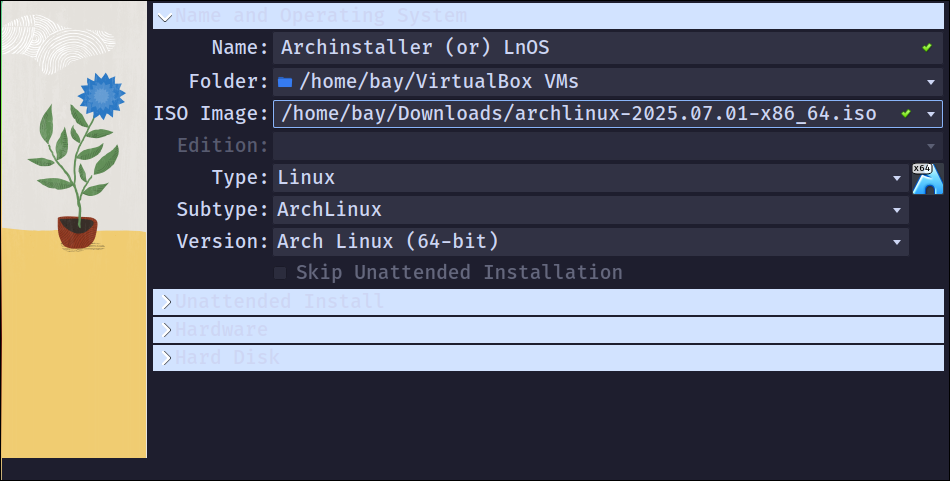
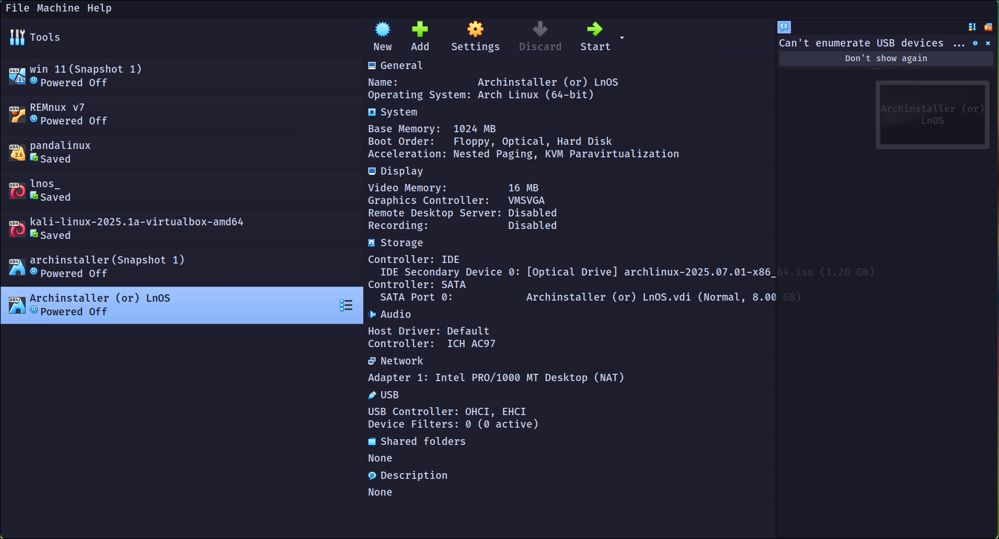
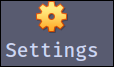
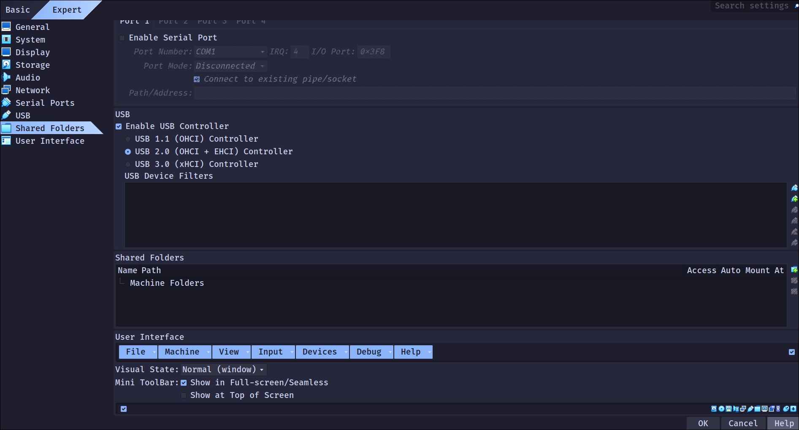
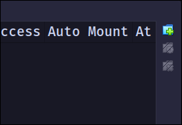
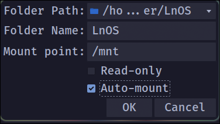

# Testing

For testing this is the process I follow

## 1. Install Virtual Box

you'll want to obtain virtualbox for whichever distro / OS you're on. 
You can go here and grab it: [virtualbox](https://www.virtualbox.org/wiki/Downloads) 

## 2. Install Arch linux iso installer

You can download the arch linux iso installer here: [Arch iso](https://archlinux.org/download/)

after you have it downloaded we can move onto using virtual box.

## 3. Fork / Clone our Repo


visit our GH here, oh wait you're already here! (or if theres online documentation then [here!](https://github.com/uta-lug-nuts/LnOS?tab=readme-ov-file#))

you can clone the repo by running
```bash
git clone https://github.com/uta-lug-nuts/LnOS.git
```
* *if you plan on contributing please Fork our Repo*
## 4. Launch Virtualbox and Configure your iso

* You should initially see something like this.

* Next what you'll want to do is click New 

* from there will be a popup that asks you a few things, you can fill out the information like this:

* Then Click finish.

* From there click on the installer you just made

* then click settings 

* From inside settings, click on Shared Folder

* click on the little + next to shared folders

* You'll get this popup that will ask you for the folder path and name, I recommend you link the Fork or cloned version of LnOS repo to this so that as you make changes to the scripts they stay up to date. 


## 5. Running the VM
Simply Click Start and the VM will fire up, you'll want to select install medium:
![[images/Pasted image 20250716193037.png]]
Once you're in you can start testing the scripts by running 
```bash
/mnt/scripts/installer.sh --target=x86_64
```
or you can just copy the installer to the current directory you're in
```bash
cp -R /mnt/
# Then run the cool scripts underneath here
```

![[images/Pasted image 20250716193209.png]]

* Future Testing Documentation will be written here as we go.
* First iteration will be testing on x86_64 first, we'll move to arm later since I doubt many students would utilize it as of now (especially with the project just starting)
